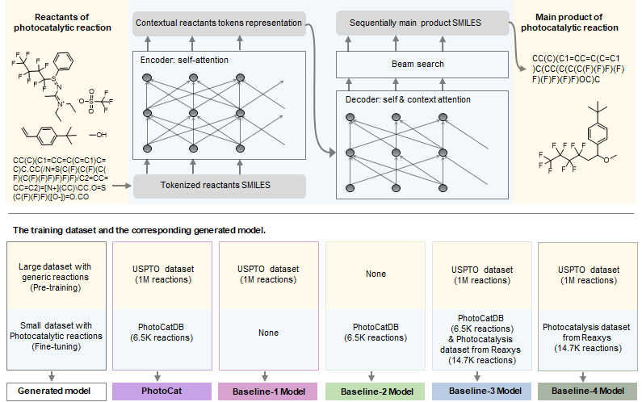

# PhotoCat

This is the code for *PhotoCat: An Artificial Intelligence-Driven Synthesis Planning Platform for Photocatalysis*

Photocatalysis is becoming increasingly important in modern chemistry for efficient multicomponent one-pot synthesis. However, predicting the results of photocatalytic reactions using artificial intelligence remains challenging, mostly due to the insufficient number of photocatalytic reactions and the incomplete information on reaction conditions in existing reaction databases. In this study, we curated the Photocatalysis Database (PhotoCatDB), which consists of 6,523 photocatalytic reactions (of which 6,175 are multicomponent) containing reaction condition information such as photocatalysts, bases or acids, additives, and solvents. Before adding reaction conditions to the training data, the attention-based deep learning model PhotoCat pre-trained on USPTO and fine- tuned on PhotoCatDB had a Top-1 accuracy of 78.16%, which was 77.70% higher than the same model trained only on the USPTO database and 14.53% higher than the model fine-tuned by the photocatalytic reactions from Reaxys. After adding reaction conditions to the training data, the Top-1 accuracy of PhotoCat was further increased to 82.25%. In addition, the interpretability of the model was reflected in its attention weights, which can infer the model’s understanding of photocatalytic chemistry. Furthermore, five previously unreported photocatalytic reactions predicted by PhotoCat were successfully validated by wet-lab experiments, demonstrating the potential of the model in identifying and verifying novel photocatalysis reactions of real-world significance.



## Setup

```bash
mamba create -nphotocat python=3.7
mamba activate photocat
pip install -r requirements.txt -i https://pypi.tuna.tsinghua.edu.cn/simple
```

The PhotoCatDB is available upon request to the author (Email: `2013010024@hzvtc.edu.cn`).

## Run

### Data Preprocessing

In this section, we outline the process of formatting catalyst information and cleaning the PC-Dataset.

- Catalyst Formatting: We represent catalysts in the following format: `catalyst: fac-Ir(ppy)3` becomes `cat_class: 1` with the `encoding 1.0.0.0`, categorized under `level 1: [v1]`.
- Data Collection Concatenation: Merge data collected from various sources in the form of `*.xlsx` files into a single `data.csv` file.
- Numerical Catalyst: Identify and extract catalyst type as numerical data.
- Reaction Canonization: Standardize the representation of reactions.
- Data Distribution Visualization: Examine and visualize data distributions.

For more detailed information, refer to the `data/light/pre.ipynb` notebook.

### Forward with catalysts classes

- Build Vocabulary: `build-forwards.sh`
  - Save in directory `preprocessing` with **suffix**
- Train: `train.sh`
- Evaluation: `eval.sh` -> `tgt-pred.txt`

### Backward

- Build Vocabulary: `build-backwards.sh`
- Train: `train-backwards.sh`
- Evaluation: `eval-backwards.sh` -> `src-pred.txt`

### Roundtrip Prediction

- After Training on Both Forward and Backward
- Run `eval-rtrp.sh` -> `tgt-pred-rtrp.txt`

### Show Results

- `rbt-evaluate.sh` -> `all_results_top*.csv`

### Detailed Steps

1. `data/biocatalysis/pre.ipynb`: Tranform data file format from `*.xlsx` to `data.csv`
2. `data/biocatalysis/get_data.ipynb`: Transform reaction format and get `data_biocatalysis.csv`
3. Rule Filter: Copy `molecules.txt` and `patterns.txt` to `data/biocatalysisV4`
4. Encode SMILES and Build Vocabulary:
  - `bash cv.sh`: Prepare CV datasets
  - `pre.sh i j`: `i` level, `j` fold
  - Output Directory: `preprocessing` with suffix(evel and fold)
5. Training: `train.sh i j`
6. Evaluation and Get Results: `after.sh i j` -> out/
7. Analyze results: `plot_results.ipynb` -> `imgs`

### TMAP Visualization

[TMAP](cluster_tmap/TMAP.ipynb)

## Acknowledgements

- This is work is based on the [Biocatalysis Model](https://github.com/rxn4chemistry/biocatalysis-model) published on [Nature Communications](https://doi.org/10.1038/s41467-022-28536-w)